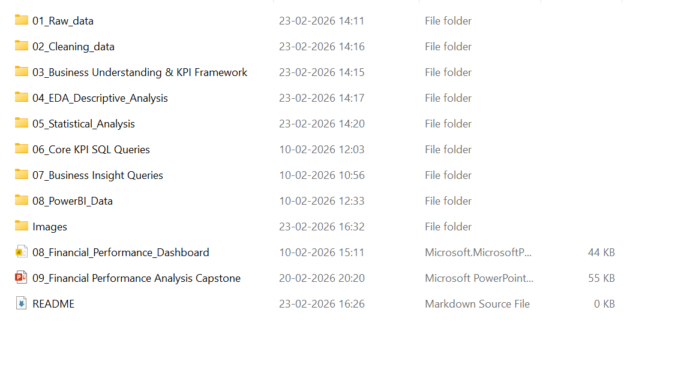
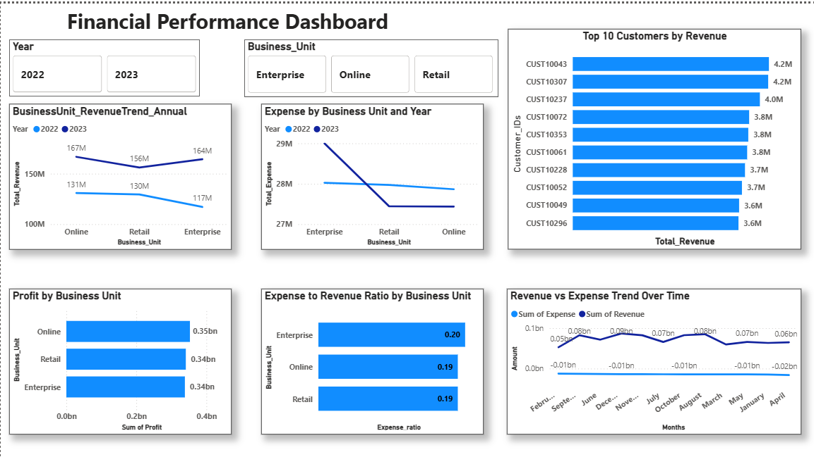
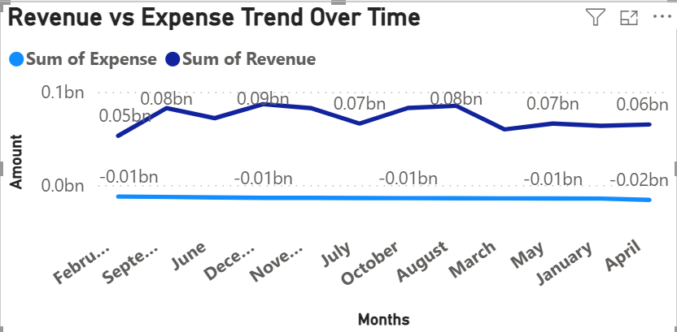

# 📊 Financial Performance Analysis & Executive Dashboard

> End-to-End Data Analytics Project  
> Tools Used: SQL • Python • Power BI • Excel

---

# 🧭 Project Overview

This project analyzes financial performance data to evaluate profitability, operational efficiency, and revenue trends across business units.

The objective was to transform raw financial data into actionable business insights and present them through an executive-level interactive Power BI dashboard.

This project simulates a real-world business reporting scenario where leadership requires structured financial monitoring and data-driven decision-making support.

---

# 🎯 Business Problem

The organization had transactional financial data but lacked:

- Centralized KPI tracking  
- Business unit performance comparison  
- Expense efficiency visibility  
- Revenue concentration monitoring  
- Statistical validation of trends  

Leadership needed a structured financial reporting framework to monitor profitability and identify potential risks.

---

# 🎯 Project Objectives

- Calculate core financial KPIs (Revenue, Expense, Profit)
- Analyze performance by business unit
- Measure operational efficiency using ratios
- Identify top revenue-generating customers
- Validate findings using statistical testing
- Build an executive-ready Power BI dashboard

---

# 🛠 Tools & Technologies

| Tool | Purpose |
|------|----------|
| **Excel / Power Query** | Data Cleaning & Preparation |
| **SQL** | KPI & Insight Querying |
| **Python** | Statistical Testing |
| **Power BI** | Dashboard & Data Visualization |

---

# 📂 Project Structure

---

# 🧹 Data Preparation

Key data preparation steps:

- Removed duplicates and null values
- Standardized date and currency formats
- Validated revenue and expense classifications
- Ensured consistent business unit tagging
- Checked aggregation accuracy

Data validation was completed before any KPI computation.

---

# 🗄 SQL Analysis

Core KPIs Calculated:

- Total Revenue  
- Total Expense  
- Profit  
- Expense-to-Revenue Ratio  
- Budget Variance  

Business Insights Generated:

- Profitability by Business Unit  
- Monthly Revenue vs Expense Trends  
- Top Customers by Revenue  
- Revenue Concentration Percentage  

---

# 📈 Statistical Analysis (Python)

To strengthen analytical reliability:

- Performed ANOVA to compare expense distribution across business units
- Conducted correlation analysis between revenue and expense
- Applied hypothesis testing to validate trend consistency

This ensured insights were not just visual, but statistically supported.

---

# 📊 Power BI Dashboard

The final dashboard was designed for executive-level financial monitoring.

### Key Features:

- KPI Summary Cards
- Revenue vs Expense Trend Analysis
- Business Unit Profitability Comparison
- Expense Efficiency Ratio Visualization
- Top Customer Revenue Breakdown
- Interactive Filters (Year, Business Unit)

---

# 📸 Dashboard Screenshots

> Add your screenshots inside the **assets/** folder and update file names if needed.

---

## 🏠 Executive Overview

---

## 📈 Revenue vs Expense Trend

---

## 🏢 Business Unit Performance

---

## 💰 Expense-to-Revenue Ratio

---

## 👥 Top Customers Analysis

---

---

# 🧠 Key Insights

- All business units are profitable
- Enterprise segment shows relatively higher cost ratio
- Revenue moderately concentrated among top customers
- Financial trends are stable with controlled expense growth
- Operational efficiency maintained across periods

---

# 💼 Business Impact

This solution enables:

- Real-time financial performance tracking
- Early identification of cost inefficiencies
- Revenue risk awareness
- Strategic decision-making support
- Transparent performance reporting

---

# 🚧 Challenges & Solutions

| Challenge | Resolution |
|------------|------------|
| Data inconsistencies | Cleaned using Power Query |
| Incorrect aggregations | Optimized data model relationships |
| DAX calculation errors | Adjusted filter context |
| Ranking complexity | Implemented dynamic Top-N logic |

---

# 🔮 Future Improvements

- Revenue forecasting (Time Series Analysis)
- What-if profitability simulations
- Row-Level Security implementation
- Automated data refresh
- Advanced segmentation analysis

---

# 🧠 Skills Demonstrated

- End-to-End Data Analytics Workflow
- Advanced SQL Querying
- Statistical Validation
- Data Modeling & DAX
- Business KPI Framework Development
- Executive Dashboard Design
- Insight Communication

---

# 🏁 Conclusion

This project demonstrates the ability to transform raw financial data into structured business insights using a multi-tool analytics approach.

It reflects both technical expertise and business-focused analytical thinking — essential for modern Data Analyst roles.

---

